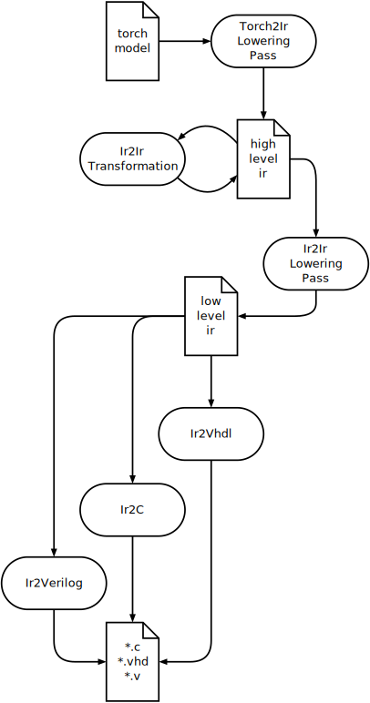

# Intermediate Representation

The intermediate representation is used to store intermediate results of
the translation process and decouple the series of steps from each
other.

**Intermediate representation in the context of the creator toolchain
flow**


We keep the specification to a minimum to keep the overhead for
developers low and make it easy to extend to individual use cases.

We define the following terms

* Node: Represents an arbitrary operation on data. Nodes can be part of one
  or more graphs. Every node has a **type** and **name**. The name of
  each node in a graph has to be **unique**. That is, for all
  $n_1, n_2 \in N_G$ holds

  $$
  \text{name}(n_1) = \text{name}(n_2) \Leftrightarrow n_1 = n_2
  $$

* Graph: The graph $G$ is a tuple of nodes $N_G$ and edges $E_G$. Many
    lowering passes will require the graph to hold additional
    attributes. Finally, each graph features an input and output node
    with the same name and type respectively. Any node that is not
    transitively connected as a source (i.e., by an outgoing edge) to
    the output node is considered a **dead node**. A node not connected
    to the input node as a destination (i.e., by an incoming edge) is an
    independent node. That means it's value does not depend on incoming
    data.

    :::{note}
    An independent node does not necessarily mean that it has a constant
    value. E.g., an independent node could be a counter, or another
    component whose output value does not depend on input, but on
    control signals like a clock.
    :::

    :::{warning}
    The required fields for graphs are very likely to change. We are
    considering requiring graphs to have a **type** and **name** as
    well, making them effectively extended nodes. This would enable
    **nested** graphs.

    Please open an issue if you need this feature.
    :::

Edge

:   An edge is a tuple of nodes, $E_G \subset N_G \times N_G$. Primarily
    the edge is supposed to model data flow. That does not prevent
    individual lowering passes to add edges for other things, e.g.,
    control signals.

Source / Destination

:   Given an edge $(n_1, n_2) \in E_G$ we call $n_1$ **source** (`src`) and
    $n_2$ **destination** (`dst`). The terms refer to the direction of data flow.
    They have been chosen over other possible terms like input/output because
    those are reserved tokens in many programming languages.

Upstream / Downstream

:   We use the terms **upstream** and **downstream** to refer to the direction
    of dataflow. Thus, downstream child nodes of a node $n$ are the nodes $m$
    that are connected to $n$ as a destination, i.e., for which $(n, m) \in E_G$.
    Upstream is the opposite direction. Upstream child nodes of $n$ are
    the nodes $m$ for which $(m, n) \in E_G$.

Lowering Pass

:   A translation stage to or from an intermediate representation, that
    makes the representation more specific. That usually involves
    converting node types and changing the semantics of types, as well
    as adding more information to nodes and edges. E.g., converting a
    convolution into a sequence of buffer, multiplier, adder and weight
    loader nodes.

Transformation

:   A translation stage that changes the graph without changing
    semantics of node types. E.g., changing the order of nodes, removing
    dead nodes, etc.

## Python implementation

The design goals for the python implementation of nodes and edges are

-   support for static type checking and custom data types

-   extension or creation of new node and edge types with minimal
    boilerplate code

-   easy inspection of the underlying data

-   consistent serialization to nested dictionaries of primitive data
    types

:::{note}
Third party solutions like protobuf or pydantic have been considered,
but finally they are either too complicated (protobuf) or do not fulfill
all our requirements: pydantic does not offer read/write access to
underlying fields through descriptors that model more complex custom
data types.
:::

## `IrData`

These goals are realized by the `IrData` class. Its metaclass,
`IrDataMeta`, customizes the object creation process, by inspecting type
annotations. The underlying data structure of each `IrData` subclass is
a dictionary of json serializable data types. This data structure is
accessible by the attribute `IrData.data`. Inspecting this field will
always give you the exact representation of the serializable data
structure, making serialization trivial. By inspecting the type
annotations of the given class attributes, the metaclass will turn these
class attributes into corresponding fields that provide type safe access
to the underlying `.data`.

``` python
from elasticai.creator.ir import IrData

class MyNode(IrData):
  name: str
  type: str


n = MyNode(dict(   # <1>
    name="my_node",
    type="my_type"
))
n.name = "new_name"  # <2>
print(n.data)   # <3>
```

1.  The default constructor takes a dictionary

2.  This will be correctly picked up by *mypy*

3.  Prints `{name="new_name", type="my_type"}`

:::{important}
Opposed to python dataclasses we do not generate a constructor based on
the provided class attributes. If you want a constructor with type hint
support you have to provide your own. Type checkers handle dataclasses
in a special way which is incompatible with some other features of
`IrDataMeta`.
:::

During lowering and transformation passes you often have to deal with
complex data, like filter parameters, shape tuples and more. To
accommodate handling this data it is necessary to access fields as
custom objects with type hints and docstrings. The
`elasticai.creator.ir` package provides a few descriptors to realize
that. Descriptors are a python concept, that allows to customize read
and write access to an objects attributes. The provided descriptors will
serialize and deserialize the underlying data on the fly.

While this introduces more overhead than a serialization on demand,
e.g., in a `asdict` method, the approach has two significant advantages

-   serialization and deserialization will fail immediately

-   we can construct a new object using another one as a prototype,
    e.g., we could use the `.data` of a `Node` to construct a `VhdlNode`
    and add missing fields afterward.

    :::{note}
    You can use `IrData.get_missing_required_fields()` to get a list of
    all fields that have been defined in the class definition but are
    missing from the underlying `.data`.
    :::

As an example the definition of the `VhdlNode` in
`elasticai.creator.ir2vhdl` looks similar to this

**simplified implementation of the `VhdlNode`**

``` python
from elasticai.creator.ir import IrData, RequiredField
from typing import TypeAlias

ShapeTuple: TypeAlias = tuple[int, int]

class Shape:
    def __init__(self, length, channels):
        self.length = length
        self.channels = channels

    def to_tuple(self) -> ShapeTuple:
        return self.length, self.channels

    @classmethod
    def from_tuple(cls, t: tuple[int, int]) -> "Shape":
        return Shape(t[0], t[1])

class ShapeField(RequiredField[ShapeTuple, Shape]):
    def __init__(self):
        super().__init__(
            set_convert=lambda x: x.to_tuple(),
            get_convert=Shape.from_tuple
        )


class VhdlNode(IrData):
    name: str
    type: str
    implementation: str
    input_shape: RequiredField[ShapeTuple, Shape] = ShapeField()
    output_shape: RequiredField[ShapeTuple, Shape] = ShapeField()
```

::: caution
The implementation of `Shape` in the example above, will create a copy
of the data that was stored in the node. That means

``` python
n = VhdlNode(dict(
    name="x", type="t",
    implementation="impl",
    input_shape=(1, 2),
    output_shape=(3, 4)
))
n.input_shape.length = 5  # WRONG!
n.input_shape = Shape(length=5,
    channels=n.input_shape.channels)  # CORRECT!
```

1.  The value is not written into the underlying `.data` because
    accessing `input_shape` will return an independent `Shape` object.

2.  This will create a new `Shape` object and write it into the
    `input_shape` field and therefore into the `.data` dictionary.

This is not a limitation of the `IrData` class but of the
`RequiredField`. To change the node's `.data` field, the shape would
have to keep a reference to it. `RequiredField` is not passing that
reference though.

Introducing a new type of field, that passes the reference to the
conversion functions would (if implemented properly) allow for nested
`IrData` objects. If you need this feature, please open an issue.
:::

## High Level IR Types

While the exact types and parameters of IR data types is often highly
dependent on the target (e.g., vhdl vs c), the purpose of the
high level IR is solely to describe the neural network and not to
specify its implementation. As such, we can define IR data types for
a concrete set of components.

Note that each of the types below represents a layer instead of an operator,
i.e. we consider them to be mappings from the example space $X$ instead of
example and parameter space $X \times \Omega$

### Convolution

Input tensors should be structured as `[L, C]`, with

* `L`: length of each example
* `C`: number of channels of each example

#### Parameters

  * `weight`: Nested array of floats. The dimensions depend on `in_channels`, `out_channels`, `kernel_size`
  * `bias`: Nested array of floats. The dimensions depend on `out_channels`. Is an empty array if no bias should be used.
  * `in_channels`: `int`
  * `out_channels`: `int`
  * `kernel_size`: `int`
  * `padding`: `str`
  * `padding_value`: `float`
  * `groups`: `int`
