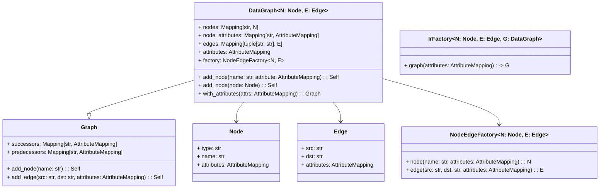

# Intermediate Representation

The intermediate representation is used to store intermediate results of
the translation process and decouple the series of steps from each
other.

**Intermediate representation in the context of the creator toolchain
flow**

We keep the specification to a minimum to keep the overhead for
developers low and make it easy to extend to individual use cases.

We define the following terms

* Node: Represents an arbitrary operation on data. Nodes can be part of one
  or more graphs. Every node has a **type** and **name**. The name of
  each node in a graph has to be **unique**. That is, for all
  $n_1, n_2 \in N_G$ holds

  $$
  \text{name}(n_1) = \text{name}(n_2) \Leftrightarrow n_1 = n_2
  $$

* Graph: The graph $G$ is a tuple of nodes $N_G$ and edges $E_G$. Many
    lowering passes will require the graph to hold additional
    attributes. Finally, most graphs feature an input and output node
    with the same name and type respectively. Any node that is not
    transitively connected as a source (i.e., by an outgoing edge) to
    the output node is considered a **dead node**. A node not connected
    to the input node as a destination (i.e., by an incoming edge) is an
    independent node. That means it's value does not depend on incoming
    data.

    :::{note}
    An independent node does not necessarily mean that it has a constant
    value. E.g., an independent node could be a counter, or another
    component whose output value does not depend on input, but on
    control signals like a clock.
    :::

    :::{warning}
    The required fields for graphs are very likely to change. We are
    considering requiring graphs to have a **type** and **name** as
    well, making them effectively extended nodes. This would enable
    **nested** graphs.

    Please open an issue if you need this feature.
    :::

Edge

:   An edge is a tuple of nodes, $E_G \subset N_G \times N_G$. Primarily
    the edge is supposed to model data flow. That does not prevent
    individual lowering passes to add edges for other things, e.g.,
    control signals.

Source / Destination

:   Given an edge $(n_1, n_2) \in E_G$ we call $n_1$ **source** (`src`) and
    $n_2$ **destination** (`dst`). The terms refer to the direction of data flow.
    They have been chosen over other possible terms like input/output because
    those are reserved tokens in many programming languages.

Upstream / Downstream

:   We use the terms **upstream** and **downstream** to refer to the direction
    of dataflow. Thus, downstream child nodes of a node $n$ are the nodes $m$
    that are connected to $n$ as a destination, i.e., for which $(n, m) \in E_G$.
    Upstream is the opposite direction. Upstream child nodes of $n$ are
    the nodes $m$ for which $(m, n) \in E_G$.

Lowering Pass

:   A translation stage to or from an intermediate representation, that
    makes the representation more specific. That usually involves
    converting node types and changing the semantics of types, as well
    as adding more information to nodes and edges. E.g., converting a
    convolution into a sequence of buffer, multiplier, adder and weight
    loader nodes.

Transformation

:   A translation stage that changes the graph without changing
    semantics of node types. E.g., changing the order of nodes, removing
    dead nodes, etc.

## Python implementation

The design goals for the python implementation of nodes and edges are

-   support for static type checking and custom data types

-   extension or creation of new node and edge types with little
    boilerplate code

-   easy inspection of the underlying data

-   consistent serialization to nested dictionaries of primitive data
    types

:::{note}
Third party solutions like protobuf or pydantic have been considered,
but finally they are either too complicated (protobuf) or do not fulfill
all our requirements: pydantic does not offer read access to
underlying fields through descriptors that model more complex custom
data types.
:::

Typically the IR you will be dealing with needs to be
problem specific though. Have a look at the `ir2vhdl`
module for an example of problem specific IR data types.