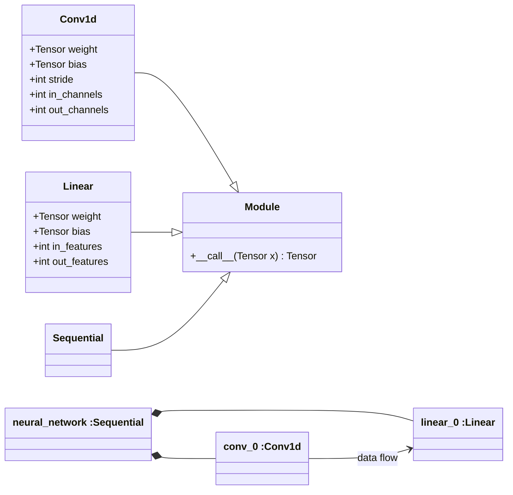
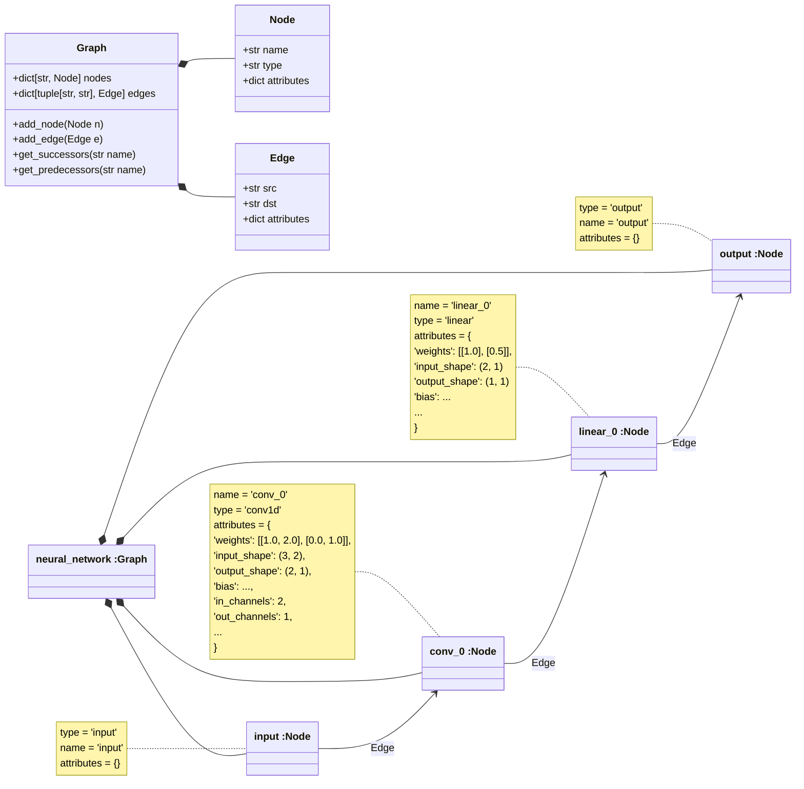

# Ir2Vhdl
Translation of IR (Intermediate Representation) to VHDL happens in two stages. For each IR graph,
these two stages are performed separately. For those familiar with the C
toolchain an IR graph is very similar to a translation unit. In the
following we will show the translation from :ir: to VHDL in the context
of the full translation pipeline and describe the two stages in more
detail.

## Overview 

Translation of a neural network model into VHDL code typically involves
several lowering passes. Each of which transforms a high-level IR into a
lower-level IR. While all these IRs rely on the same core datastructures
`Node`, `Edge`, `Graph`, the concrete representations may contain a
lot more information.

Let's assume we have a neural network defined in an MK framework that
looks like the following.

:::
##### Network from ML framework
:::



## Stage 1: High-level IR

In a first step we translate this network into a high-level intermediate
representation (IR), containing just enough data to describe all
relevant parameters and the structure of the network.

**Network after translation to IR**

:::{caution}
As most nodes have input and output shapes, we are considering making
those members required fields for the `Node` data class.
:::

This representation will be consumed by a lowering pass. The lowering
pass will transform the high-level IR into a lower-level IR. Depending
on its structure, this lower-level IR can be either translated to a
target language (e.g., VHDL) or further transformed into an even
lower-level IR.

## Stage 2: Low-level IR 

For simplicity we assume that we are applying a lowering pass that
produces an IR that is suitable for translation to VHDL. We provide the
result in json as the class diagrams from above become more and more
complex. The result could look like this

``` json

[
  {
    "name": "neural_network",
    "type": "clocked_combinatorial",
    "attributes": {
      "runtime_input_shape": [2, 4],
      "top_kernel_size": 2,
      "top_stride": 1,
      "runtime_output_shape": [1, 1]
    },
    "nodes": [
      {
        "name": "input",
        "type": "input",
        "implementation": ""
      },
      {
        "name": "conv_0_i0",
        "type": "mac",
        "implementation": "conv_0",
        "input_shape": [2, 2],
        "output_shape": [1, 1]
      },
      {
        "name": "conv_0_i1",
        "type": "mac",
        "implementation": "conv_0",
        "input_shape": [2, 2],
        "output_shape": [1, 1]
      },
      {
        "name": "linear_0_i0",
        "type": "mac",
        "implementation": "linear_0",
        "input_shape": [2, 1],
        "output_shape": [1, 1]
      }
    ],
    "edges": [
      {
        "src": "input",
        "dst": "conv_0_i0",
        "src_dst_indices": [
          [0, 0],
          [1, 1],
          [2, 2],
          [3, 3]
        ]
      },
      {
        "src": "input",
        "dst": "conv_0_i1",
        "src_dst_indices": [
          [2, 0],
          [3, 1],
          [4, 2],
          [5, 3]
        ]
      },
      {
        "src": "conv_0_i0",
        "dst": "linear_0_i0",
        "src_dst_indices": [[0, 0]]
      },
      {
        "src": "conv_0_i1",
        "dst": "linear_0_i0",
        "src_dst_indices": [[0, 1]]
      },
      {
        "src": "linear_0",
        "dst": "output",
        "src_dst_indices": [[0, 0]]
      }
    ]
  },
  {
    "name": "conv_0",
    "type": "mac",
    "weight": [[1.0, 0.0, 1.0, 0.1]],
    "bias": [],
    "nodes": [],
    "edges": []
  },
  {
    "name": "linear_0",
    "type": "mac",
    "weight": [[1.0], [0.0]],
    "bias": [],
    "nodes": [],
    "edges": []
  }
]
```

Several noteworthy things happened in this lowering pass:

-   The node `'conv_0'` was replaced by `'conv_0_i0'` and `'conv_0_i1'`.
    This is because the convolution operation was split into two parts.
    The first part computes the first output element and the second part
    computes the second output element. This is a common optimization in
    hardware design to increase parallelism. The two new names will
    directly be used for the entity instances in the generated VHDL
    code.
-   Two new IR graphs were created: `"conv_0"` and `"linear_0"` (at the
    end of the file). These graphs do not contain any nodes or edges,
    but their weights and biases as well together with their type will
    be used to generate the corresponding VHDL designs in the next step.
-   The types for convolutions and linear layers were changed to
    `"mac"`, because that is the operation we want to apply at this
    level.

## Stage 3: VHDL Generation 

The third stage is where the low-level IR is translated into VHDL code.
Usually one IR graph will be translated into one VHDL entity. Exceptions
to this are possible though, e.g., to split complex designs into
multiple smaller entities.

::: {caution}
We might limit this behaviour in the future, to ensure a one-to-one
relationship between IR graphs and resulting VHDL code, in case problems
like name clashes arise.
:::

Each node in a graph will be translated into the instance of a vhdl
entity. We interpret the edges as data flow between instances.
Dependending on the IR graph we need to translate we have to solve one
or more of the following problems:

1.  decide what algorithm to use for the following steps

    -   determined by the **type** of the implementation

2.  set correct default generic parameters for currently generated
    entity

    -   determined **attributes** and **input/output nodes** of the
        implementation

3.  define control signals for each instance

    -   determined by the **type** of each node

4.  define data signals for each instance

    -   determined by the **input/output shape** of each node

5.  connect the instances using the correct data/control signals

    -   deterimined by the **edges** of the implementation and node
        **types**

6.  instantiate the entities with the correct generic parameters

    -   determined by node **attributes** and **type**

7.  instantiate the entities with the correct port mappings

    -   determined by node **type** and implementation **edges**

The following software components play an important role during code
generation:

`template.TemplateBuilder`

:   allows to generate templates from given strings.

`vhdl_template.EntityTemplateDirector`

:   uses the `TemplateBuilder` to generate templates for VHDL entities.

`ir2vhdl.Instance`

:   contains the knowledge about the interface of an entity, i.e., the
    ports and generics, and provides a function to generate VHDL code
    for instantiating the entity.

`ir2vhdl.InstanceFactory`

:   is responsible for creating `Instance`s from nodes in an IR graph.

While the classes above live in the `elasticai.creator` package,
specific implementations live in the `elasticai.creator_plugins`
namespace.

As such it is up to each of the plugins that support translating a
specific type of implementation to know how to handle each of the
encountered node types. As an example we consider the `combinatorial`
plugin. It features set of different node types with two different
interfaces. The supported node types are:

-   `shift_register`

-   `striding_shift_register`

-   `sliding_window`

-   `clocked_combinatorial`

-   `unclocked_combinatorial`

-   `input`

-   `output`

::: note
including (un)clocked combinatorial allows us to nest combinatorial
designs
:::

The `combinatorial` plugin defines a `Instance` type for each of these
nodes types and uses the `InstanceFactory` to create instances from
nodes in an IR graph.
