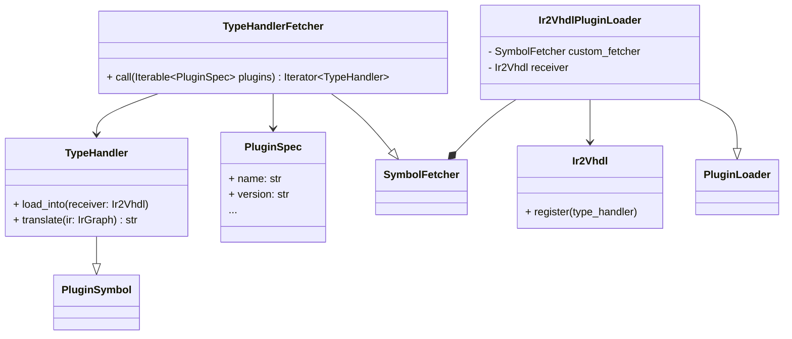
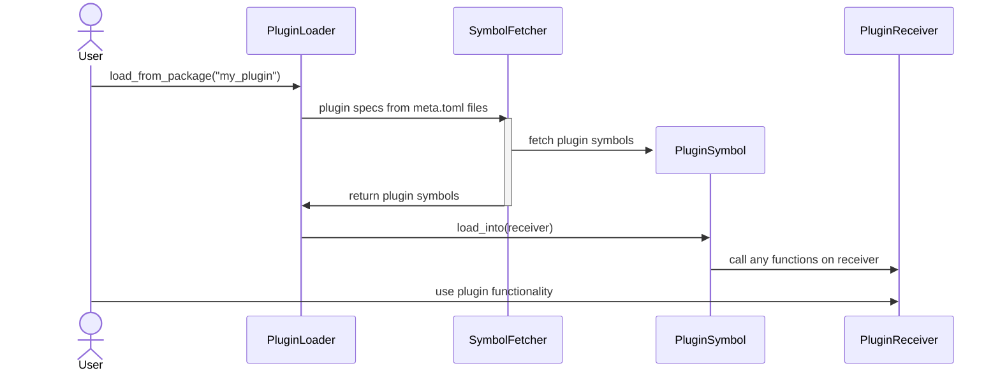

# Plugin system

The plugin system ([`elasticai.creator.plugin`]()) is
the way to extend automated lowering passes ([`LoweringPass`]()). At its
core the system is not limited to any specific target.
E.g., it can be used to extend the following passes: Ir2Ir, Ir2Verilog, Ir2Torch, Ir2Vhdl, etc.

Currently its main purpose is providing a base for adding new hardware
components as plugins to the [`Ir2Vdhl`]() translation
pass.

## Terminology 

plugin

:   A self contained collection of documentation, tests, metadata
    (plugin spec) and code that extends the functionality of the
    ElasticAI Creator

plugin symbol

:   One of the parts of a plugin that provides the new functionality

plugin spec

:   A description (specification) of a concrete plugin

plugin loader

:   A component responsible for discovering and adding plugins to a part
    of the creator

plugin receiver

:   The part of the creator (or even of another plugin) extended by the
    plugin symbols

## Design goals 

The goals during the design of the system were

-   flexibility for plugin loaders

    -   decide which symbols to load and how to add them to the plugin
        receiver

-   ease of use for plugin creators

    -   good support through static type hints

-   flexibility for plugins and their symbols

    -   decide how to deal with the provided plugin receiver

The design goals above are achieved by extensive use of generic
parameters and a double dispatch system between plugin symbols and
plugin receivers.

## Overview 

The system evolves around five roles:

`PluginSpec`

:   Concrete description of a specific plugin. Has all information
    required to load and use the plugin.

    -   kind of the plugin

    -   plugin content

`PluginSymbol`

:   A symbol that the plugin exports. Exported symbols have to implement
    this protocol.

    -   functionality of the plugin

`PluginLoader`

:   Will call `load_into` hooks on plugin symbols.

    -   make plugin contents available to a *receiver*

`SymbolFetcher`

:   A protocol to fetch symbols from a plugin. The plugin loader will
    use objects implementing `SymbolFetcher` to discover the symbols
    that the plugin provides. You can use this to filter out symbols or
    add more symbols based on your needs.

    -   discover symbols from a plugin spec

    -   fetching in this context means to make the symbol available in
        any way. This can happen by loading via `importlib` or creating
        the symbol in any other way.

*Plugin Receiver*

:   Not matched by a class or protocol for this role. The loader will
    call `.load_into(self.receiver)` on every discovered symbol to load
    it.

    -   receives plugin symbols

**Example of the plugin system realizing Ir2Vhdl plugins (altered for
clarity, brevity and because class diagrams are bad at representing
functions)**

**Simplified visualization of the control flow between the four active
roles**

## Fetching symbols 

The `SymbolFetcher` protocol is roughly defined like this

``` python
class SymbolFetcher(Protocol):
    def __call__(self, plugin_spec: Iterable[dict[str, str | tuple[str, ...]]]) -> Iterator[PluginSymbol]:
        ...
```

Creating the `PluginSymbol`s from the plain dictionaries can present a
complex task. To ease creation of new symbol fetchers the plugin package
offers a few functions and a `SymbolFetcherBuilder` to help with this
task. It provides two methods

`add_fn(fn: Callable[[PluginSpec], PluginSymbol])`

:   Define how to handle a single plugin spec, iteration over all
    available specs will be handled by the builder.

`add_fn_over_iter(fn: Callable[[Iterable[PluginSpec], Iterator[PluginSymbol]]])`

:   Define how to handle the full list of plugin specs. Use this in
    cases where you want to skip or add specs or symbols.

Additionally, the builder takes a plugin spec type (`type[PluginSpecT]`)
as an argument. This constructor will be used to infer the new plugin
spec objects from the dictionaries that the plugin loader reads from the
meta files.

The example defines a `PrintingLoader`. For brevity this loader also
acts as the receiver (remember that the receiver is only restricted by
the concrete use case, not by the plugin system). The fetcher function
defined in the constructor is used to import symbols from a package and
append a symbol that is created dynamically. The symbols from the
package are imported from the `generated` field of the plugin spec. They
are free to call any functions of the `PrintingLoader`, e.g., to
`do_something_useful`. The appended `_PrintingSymbol` object will
instead print

    'just printing some text'

when loaded and do nothing more.

``` python
from elasticai.creator.plugin import (
    SymbolFetcherBuilder,
    PluginSpec,
    PluginLoader,
    PluginSymbol,
    import_symbols
)

class _PrintingSymbol(PluginSymbol["PrintingLoader"]):
    def load_into(self, receiver: "PrintingPluginLoader") -> None:
        receiver.print_symbol("just printing some text")

class PrintingLoader(PluginLoader["PrintingLoader"]):
    def __init__(self) -> None:
        def fetch(data: Iterable[PluginSpec]) -> Iterator[PluginSymbol[T]]:  # <1>
            for p in data:
            yield from import_symbols(f"{p.package}.src", p.generated)  # <2>
            yield _PrintingSymbol()  # <3>

        super().__init__(
            fetch=(SymbolFetcherBuilder(PluginSpec).
                add_fn_over_iter(extract_symbols).   # <4>
                build()),
            plugin_receiver=self,
        )

    def print_symbol(self, text: str) -> None:
        print(text)

    def do_something_useful(self, plugin: PluginSymbol["PrintingLoader"]) -> None:
        # run code for useful stuff
        pass
```

1.  There are two variants of functions that can be added to the
    `SymbolFetcherBuilder`, both take a different data parameter type:

    -   `Iterable[PluginSpecT]`: The function will be called a single
        time for all discovered plugin specs. This is useful if the
        function needs to know about all plugins at once or if you want
        to load symbols even if no plugin specs were found.

    -   `PluginSpecT`: The function will be called for each plugin spec.
        It exists for convenience, so you do not have to iterate
        yourself.

2.  Get all symbols from the `generated` field of the plugin spec and
    import them from the module `'{p.package}.src'`.

3.  This symbol is not loaded from a module but is created on the fly.

4.  Because python does not support singledispatch on protocols, there
    are two methods to add functions to the builder.
