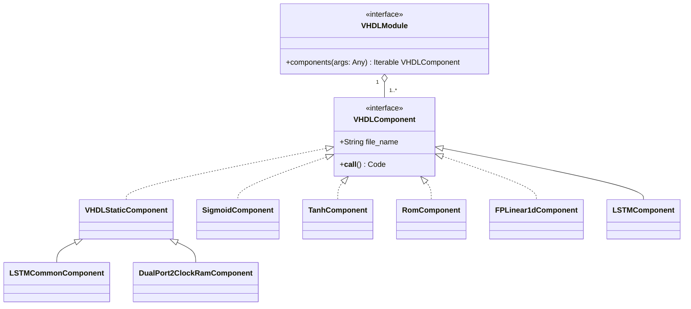
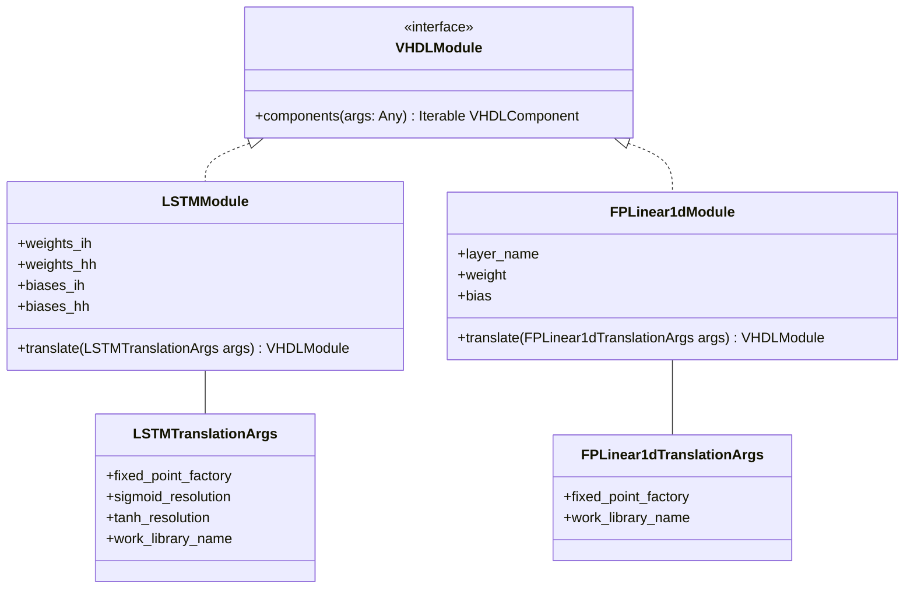
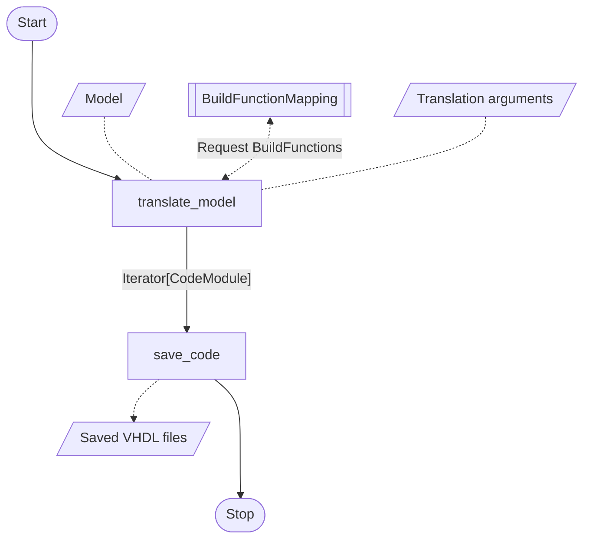

# Structure of the translator

The actual translator, which can translate a model into a VHDL implementation, can be found in the package
`elasticai.creator.vhdl_for_deprecation.translator`. An implementation for translating PyTorch models to VHDL can be found in the module
`elasticai.creator.vhdl_for_deprecation.translator.pytorch.translator`.

## Translation with the help of templates

To translate a particular component into VHDL, we use templates. A template is a VHDL text file which contains
placeholders, which are filled with values by a so-called `VHDLComponent` class. A `VHDLComponent` class is
a class that contains a filename of the VHDL file and returns the code without placeholders when the object is called.
For each component we create an implementation of the `VHDLComponent` protocol that replaces the placeholders.
An incomplete class diagram illustrating this is the following:

Static VHDL files that have no placeholders are represented by a `VHDLStaticComponent`.

A layer (e.g. an LSTM layer) can consist of more than one VHDLComponent. For this reason we call a
`Iterable[VHDLComponent]` a `VHDLModule`.

## VHDLModules

In order to represent a layer independently of the machine learning framework used, every layer that needs to be
translated is represented as VHDLModule. A `VHDLModule` class has a `components` function that takes a
DTO (Data Transfer Object) which contains all necessary parameters from the user to translate the layer to VHDL and
returns a `VHDLModule` as the result of the translation.

An incomplete class diagram showing this for the `LSTMModule` and `FPLinear1dModule` is the following:

## Build Functions

To convert a layer from a particular machine learning framework to the corresponding VHDLModule, we use build
functions for each layer of the machine learning framework. A build function is a function that takes the current layer
object of the machine learning framework and returns a `VHDLModule` object. In this build function, all the
necessary parameters of the layer are extracted and these parameters are used to create the corresponding VHDLModule
object. To translate a model of a machine learning framework, there is a `BuildFunctionMapping` that maps all supported
layers to their corresponding build function.

We already provide a predefined `BuildFunctionMapping` instance that translates each layer in a typical way
(`elasticai.creator.vhdl_for_deprecation.translator.pytorch.build_function_mappings.DEFAULT_BUILD_FUNCTION_MAPPING`).

## Translation process
In the following diagram you can see the typical process of translating a given PyTorch model into VHDL files using
the functions `translate_model` and `save_code` which can be found in the module
`elasticai.creator.vhdl_for_deprecation.translator.pytorch.translator`:

