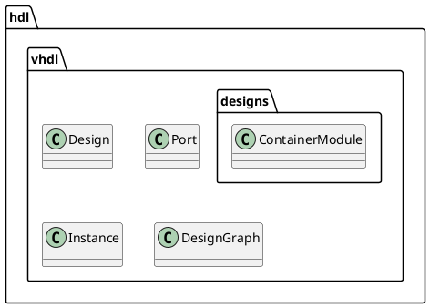

# Architecture
## elasticai.creator.vhdl
### Dependencies

```plantuml
@startuml

class FolderImpl as "Folder"




    package language_structure {
    +class Design<T> {
     +instantiate(): Instance<T>
     +port: Port<T>
     +name: str
    }
    note left: structural representation of\na hw design for the purpose\nof automatic connection and\ninstantiation of hw designs


    +class Port<T> {
      +in_signals: set<T>
      +out_signals: set<T>
      +signals(): set<T>
    }

    +class Instance<T> {
      +name: str
      +design: Design<T>
    }


  }


  package vhdl {



    package designs {
      package autowired_modules {
        class ModuleContainer {
          - submodule_graph
        }
        class WireableInstance
        class AutoWireSignal as "Signal"

      }
    }
    note right of designs: entry point for\nhw designers to\nadd new designs


    package template_resources {
    }

   +interface Saveable {
    +save_to(destination: Folder)
   }


  +interface Folder {
    +new_file(name: str): File
    +new_folder(name: str): Folder
  }

  +interface File {
    +write_text(Iterable<str>)
    +write_text(str)
  }

    ~abstract class BaseDesign {
    }
    note bottom: be sure to not let\nport/signal/instance\nleak out of BaseDesign\n or designs package

    ~class VHDLCodeGenerator as "CodeGenerator" {
    }

    package auto_wiring {
      class WiringStrategy<T extends Acceptor> {
        wire()
        get_source_sink_connections(): list<tuple<T, T>>
      }

      interface WireableNode<T extends Acceptor> {
        in_signals: list<T>
        out_signals: list<T>
      }
      WiringStrategy --> WireableNode
    }

    ~class VHDLSignal as "Signal" {
      +name: str
      +width: int
    }

    ~class VHDLTemplate as "Template" {
    }

  }



  package dataflow {

    +interface Acceptor<T> {
      +accepts(T): bool
    }


    +class DataFlowNode<T extends Acceptor> {
        +sinks(): list<Sink<Source<T>>>
        +sources(): list<Source<T>>
        +children(): list<DataFlowNode<T>>
        +parents(): list<DataFlowNode<T>>
        +append(Node<T> child)
        +prepend(Node<T> parent)
        +is_satisfied(): bool
        +{static}create(sinks: list<T>, sources: list<T>): DataFlowNode<T>
    }


    +class Sink<T extends Acceptor> {
        +source: Optional<Source<T>>
        +data: T
        +owner: DataFlowNode<T>
        +is_satisfied(): bool
        +accepts(Source<T>): bool
    }

    +class Source<T> {
        +data: T
        +sinks: list<Sink<T>>
        +owner: DataFlowNode<T>
    }
  }

  package code_generation {
    abstract class BaseTemplate
    class CodeGenerator {
      +{static}int_to_bitstring(number :int, total_bits: int): str
      +{static}float_to_fixed_point_bit_string(number: float, total_bits: int, frac_bits: int): str
      +{static}int_to_hex_string_little_endian(number: int, bits: int): str
    }
  }


package translatable_modules {
}

package mlframework.torch.nn {
}

package graph {
    interface Node<T extends Node> {
      children(): list<T>
      parents(): list<T>
    }
}


DataFlowNode <-* Sink
DataFlowNode <-* Source
Source <--> Sink
Sink --> Acceptor
VHDLTemplate --|> BaseTemplate

FolderImpl ..|> Folder

WireableNode --> Acceptor
WireableNode --|> Node

WireableInstance ..|> WireableNode

VHDLCodeGenerator --> CodeGenerator
BaseDesign --> language_structure
designs --|> BaseDesign
designs --> VHDLCodeGenerator
BaseDesign ..|> Saveable
BaseDesign --> Folder

Design --* Port
Design --> Instance
Instance --o Design

VHDLTemplate --> template_resources
designs --> VHDLTemplate
translatable_modules --> designs
translatable_modules --|> mlframework.torch.nn
translatable_modules --> FolderImpl

WiringStrategy --> dataflow
auto_wiring --> language_structure
AutoWireSignal --> VHDLSignal
AutoWireSignal ..|> Acceptor
ModuleContainer --> AutoWireSignal
ModuleContainer --> WireableInstance
ModuleContainer --> WiringStrategy

class FileImpl as "File" implements File
FolderImpl --> FileImpl
FolderImpl --> File
note bottom of translatable_modules: this is where we feed module\nparameters to hw and to convert\nml framework data types to basic\npython types
note top of translatable_modules: used to create trainable module\nand translate it to hw.\nEvery module class corresponds to a\nDesign python class and every module\ninstance corresponds to an object of type Design.\nEvery use of/call to a module inside another module\ncorresponds to an object of class\nlanguage_structure.Instance





@enduml
```

## Responsibilities/Packages
- **templates**: streamlined filling of templates
  - Template
  - VHDLTemplate
  - ...
- **parsing**: basic parsing of vhdl files
  - Portarser
  - PortMaparser
  - ...
- **modules**: Trainable Machine Learning Module
  - LSTM
  - LinearLayer
  - ...
- **translatable modules**: combines designs and modules to create modules that can be translated to VHDL
  - FPHardSigmoidWithLookupTable
  - ...
- **language**: very basic structural representation of vhdl language concepts,
  exposing information needed by other components for auto-wiring vhdl
  - Entity
  - Port
  - Signal
  - ...
- **designs**: hardware designs, some of which use graph structures for auto-wiring components
  - each design decides how it is serialized to disk
    - a design can either consist of a single file or a folder with several files and subfolders
    - the design is dictated a base name that needs to be used for saving, e.g, "linear_0", then we can
      either write content to files in a directory named "linear_0" or content to a file named "linear_0.vhd"
  - examples
    - MonotonousLookupTableBasedFPFunction
    - Precomputed1DConv
    - XNORPopCount1DConv
    - AcceleratorContainer
- **code generation**: basic code generation functions, e.g., to convert basic data types to strings
  - int_to_binary_string
  - create_block, block with configurable begin and end, that encloses subsequent code
  - int_to_hex_string
  - padded_hex_string_from_int
  - ...
- **vhdl code generation**: basic code generation functions that are specific to vhdl code
  - port_map_from_signals
  - port_from_signals
  - signal_definition
  - signal_connection
