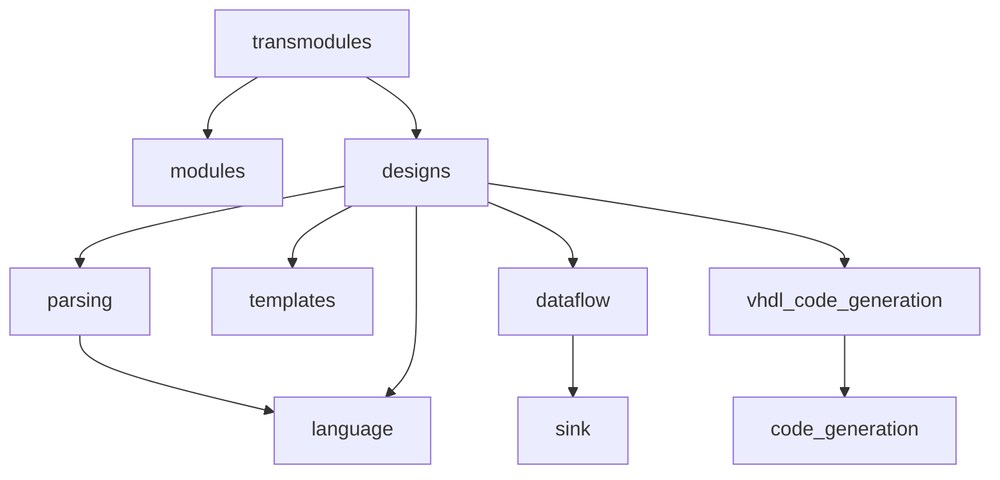
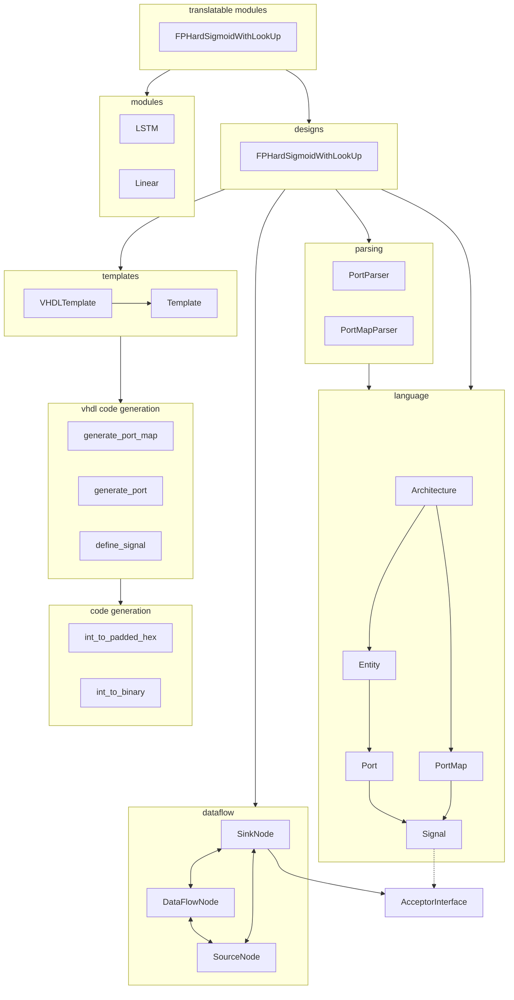

# Architecture
## elasticai.creator.vhdl
### Dependencies

### Dependencies with example classes

## Responsibilities/Packages
- **templates**: streamlined filling of templates
  - Template
  - VHDLTemplate
  - ...
- **parsing**: basic parsing of vhdl files
  - PortParser
  - PortMapParser
  - ...
- **modules**: Trainable Machine Learning Module
  - LSTM
  - LinearLayer
  - ...
- **translatable modules**: combines designs and modules to create modules that can be translated to VHDL
  - FPHardSigmoidWithLookupTable
  - ...
- **language**: very basic structural representation of vhdl language concepts,
  exposing information needed by other components for auto-wiring vhdl
  - Entity
  - Port
  - Signal
  - ...
- **designs**: hardware designs, some of which use graph structures for auto-wiring components
  - MonotonousLookupTableBasedFPFunction
  - Precomputed1DConv
  - XNORPopCount1DConv
  - AcceleratorContainer
- **code generation**: basic code generation functions, e.g., to convert basic data types to strings
  - int_to_binary_string
  - create_block, block with configurable begin and end, that encloses subsequent code
  - int_to_hex_string
  - padded_hex_string_from_int
  - ...
- **vhdl code generation**: basic code generation functions that are specific to vhdl code
  - port_map_from_signals
  - port_from_signals
  - signal_definition
  - signal_connection
