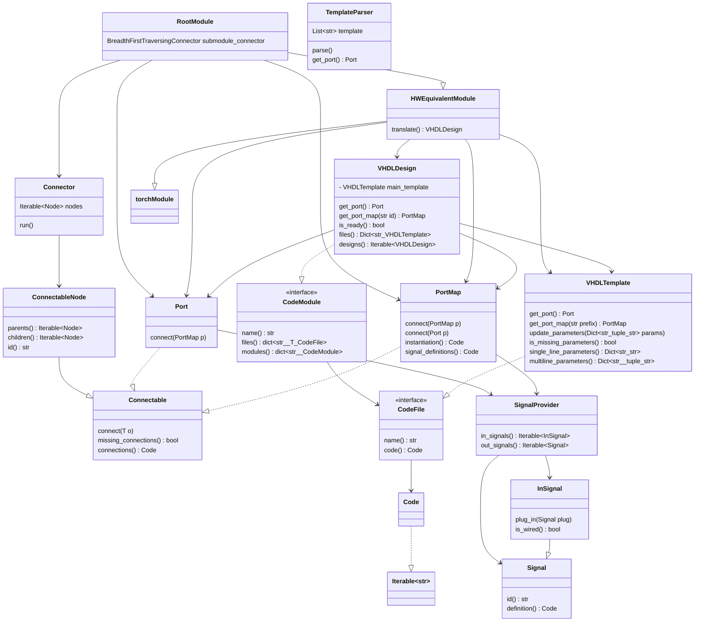

# Architecture
## elasticai.creator.vhdl


We use the vhdl template as a source to read the port definition.

```python
class VHDLTemplateBasedBlock(AbstractBaseHWBlock):
    """ Parses underlying vhdl source code to provide the HWBlock interface.
    Thus it provides VHDL Designers a convenient way to implement said interface.
    """
    ...


from typing import Protocol
from collections.abc import Collection
from collections.abc import Iterable
from itertools import chain


class CodeFile(Protocol):
    def code(self) -> Iterable[str]: ...

    def name(self) -> str: ...


class CodeModule(Protocol):
    def files(self) -> Collection[CodeFile]: ...

    def submodules(self) -> Collection["CodeModule"]: ...


class Translatable(Protocol):
    def translate(self) -> CodeModule: ...


class VHDLDesign(Protocol):
    def get_parameter_ids(self) -> list[str]: ...

    def update_parameters(self, **kwargs) -> None: ...

    def get_port(self) -> "Port": ...

    def create(self) -> CodeModule: ...


class FPLinearHWTranslatable("FPLinear", Translatable):
    def __init__(self, *arg, **kwargs):
        super().__init__(*arg, **kwargs)
        self._designer = FPLinearVHDLDesign()

    def get_interface(self) -> "VHDLInterface":
        return self._designer.get_port()

    def translate(self) -> CodeModule:
        params = self._extract_parameters()
        self._designer.update_parameters(**params)
        return self._designer.create()


class RootDesign()


class Root("Module", Translatable):
    def __init__(self):
        super().__init__()
        self._designer = RootDesign()

    def get_interface(self) -> "VHDLInterface":
        return self._designer.get_port()

    def translate(self) -> CodeModule:
        graph = Tracer().trace(self)
        connector = PortConnector()
        signal_definitions = chain.from_iterable((node.signal_definition() for node in graph.nodes))
        port_maps = (node.port_map() for node in graph.nodes)
        sub_modules = (node.translate() for node in graph.nodes)
        for node in reversed(graph.nodes):
            connector.append(node)
        connections = connector.connection()
        self._designer.update_parameters(
            connections=connections,
            signal_definitions=signal_definitions,
            port_maps=port_maps
        )
        return self._designer.create()


```
The vhdl designer writes a template. Together with the AI optimization expert she
implements a translatable layer, by implementing the `translate` method.
4
