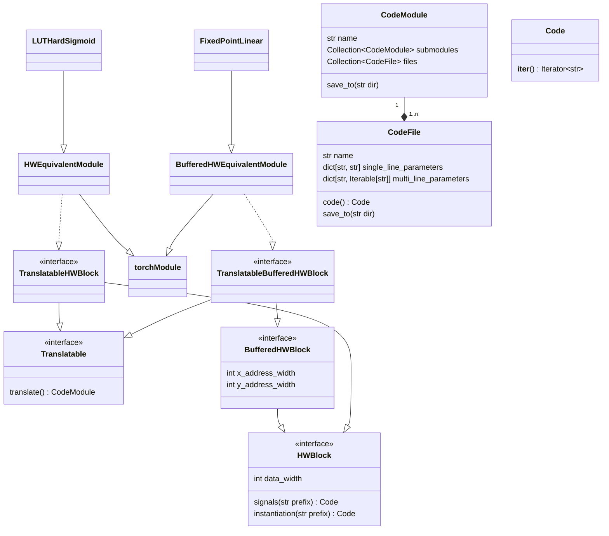

# Architecture

```mermaid
classDiagram
  class HWBlock {
    int data_width
    signals(str prefix) Code
    instantiation(str prefix) Code
  }
  
  class Translatable {
    translate() CodeModule
  }
  
  <<interface>> Translatable
  <<interface>> HWBlock
  
  class HWEquivalentModule
  HWEquivalentModule ..|> TranslatableHWBlock
  HWEquivalentModule --|> torchModule
  BufferedHWEquivalentModule ..|> TranslatableBufferedHWBlock
  BufferedHWEquivalentModule --|> torchModule
  class BufferedHWBlock {
    int x_address_width
    int y_address_width
  }
  BufferedHWBlock --|> HWBlock
  TranslatableHWBlock --|> HWBlock
  TranslatableHWBlock --|> Translatable
  TranslatableBufferedHWBlock --|> BufferedHWBlock
  TranslatableBufferedHWBlock --|> Translatable
  FixedPointLinear --|> BufferedHWEquivalentModule
  LUTHardSigmoid --|> HWEquivalentModule
  
  <<interface>> TranslatableHWBlock
  <<interface>> TranslatableBufferedHWBlock
  <<interface>> BufferedHWBlock
  CodeModule "1" --* "1..n" CodeFile
  CodeModule: str name
  CodeModule: save_to(str dir)
  CodeModule: Collection~CodeModule~ submodules
  CodeModule: Collection~CodeFile~ files
  class CodeFile {
    str name
    dict[str, str] single_line_parameters
    dict[str, Iterable[str]] multi_line_parameters
    code() Code
    save_to(str dir)
  }
  class Code {
    __iter__() Iterator~str~
  }

```

User example code
```python
model = MyVHDLModel()
vhdl_module = model.translate()
vhdl_module.save_to("my_build_directory")
```