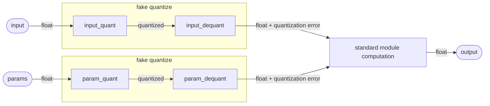

# Quantized Modules
Custom modules that enable QAT and simulated quantized inference.

## Quantized Module structure
A correctly defined quantized module must be an `torch.nn.Module` that implements a `forward(...)` and a `quantized_forward(...)` function. Additionally the module should have at least a `input_quant` and `input_dequant` attribute defined. If the module has parameters that needs to be quantized than the module should also has an `param_quant` and `param_dequant` attribute defined.

The `forward`-function is used for QAT to and takes an floating point input and returns also a floating point output (more in [this](#quantization-schema) section).

The `quantized_forward` function is intended to perform simulated quantized inference. It is not intended for training. This means that the function expects a quantized input and then calculates the output according to the rules of the chosen representation.

The `input_quant`/`input_dequant` and `param_quant`/`param_dequant` attributes must contain a function with the signature `Callable[[torch.Tensor], torch.Tensor]` and must be a `torch.autograd.Function` at the end. The `..._quant` functions convert the values of a given tensor into their quantized representation (unquantized --> quantized). The `..._dequant` functions do exactly the opposite (quantized --> unquantized). The distinction between parameters and inputs allows to choose different quantization schemes for the inputs and the parameters.

## Quantization Scheme
The quantization scheme that must be implemented in the `forward`-function of a quantized module is the following:

The fake quantization introduces an quantization error which should be minimized during quantization-aware-training.

## Autograd Functions
For all currently supported quantized representations we provide autograd functions for quantizing and dequantizing tensors. These are to be used for the `..._quant`/`..._dequant` attributes of a quantized module. They also implement a straight-through estimator to ensure correct training.
