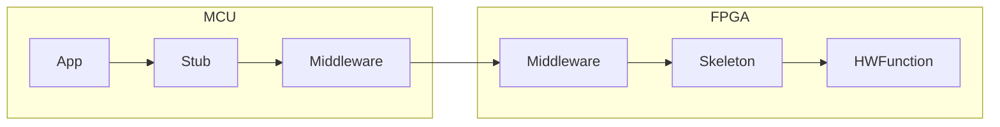

# Using the neural network accelerator

The FPGA and MCU are connected vai SPI and four GPIO pins:

 | MCU | FPGA|
 |-----|-----|
 | PIO13 | GPIO0|
 |PIO14 | GPIO1 |
 | PIO15 | GPIO2 |
 |PIO20 | GPIO3 |

To expose the network accelerator to an application, running on
an MCU, we use a middleware.
An application can call a small set of c functions (stub),
to interact with a given HWFunction.
This stub is specific to its corresponding HWFunction.
In our case the HWFunction corresponds to the neural network accelerator.

 - **App**: user supplied application, calling stub to access neural network accelerator (HWFunction)
 - **Stub**:
   - passes data to the HWFunction and starts the computation
   - returns results of computation
   - allows **App** to check if HWFunction is loaded or not
   - allows **App** to load HWFunction
 - **Middleware**:
   - load bitfiles from specific addresses in flash memory
   - disable/enable skeleton, ie. its corresponding HWFunction
   - pass memory mapped io through to skeleton
 - **Skeleton**:
   - counterpart to stub
   - specific to HWFunction
 - **HWFunction**:
   - in general an arbitrary function we want to execute on the FPGA
   - here: the neural network accelerator

## Middleware Memory Mapped IO via SPI

We transmit data via SPI in the following format to interact with the FPGA. The FPGA :
 - First two byte determines the message type, transmitted high byte first.
 - the rest of the transferred data is the payload
 - c code example of read/write:
   - `uint16_t write_command = command | 0x8000;`
   - `uint16_t read_command = command & 0x7FFF;`
 - The start of a message is marked by pulling down the SPI slave select line, the end is marked by pulling the slave select line up

 | bit 15  | bits 14-0    |
 |---------|--------------|
 | r=0/w=1 | message type |

**Message Types: 0x00 - 0xFF:**
- LED: 0x03 (1 byte)
  - each of the lowest four bits control one of the LEDs
  - 0=off, 1=on
  - eg., command to turn on first led: `char command[] = {0x80, 0x03, 0x01}; for (i=0; i < 3; i++) {send_byte(command[i]);}`
- USERLOGIC_CONTROL: 0x04 (1 byte)
  - sets the reset pin of the skeleton
- Multiboot: 0x05-0x07 (3 bytes)
  - start address of the configuration to load from flash
  - triggers reconfiguration after write to 0x07 is complete
  - always write all three bytes
  - starting with the lowest byte of the address to 0x05
  - example command: `{0x80, 0x05, 0xAA, 0xAA, 0xAA}`, where the `0xAA` bytes specify where in the flash memory the configuration is we want to load
- other message types (0x08-0xFF) are reserved for future uses

**User Logic Region: 0x100 - ??**
- passed through to skeleton
- the offset 0x100 is transparent to stub and skeleton

## Skeleton v1
The supported address range for the neural network skeleton ranges from
0 to 99.
The skeleton we use for neural networks uses its memory mapped io
as follows:

|mode | address (bytewise) | value (byte) | meaning                                   |
|-----|--------------------|--------------|-------------------------------------------|
|write| 100                | 0x01         | start computation                         |
|write| 100                | 0x00         | stop computation                          |
|write| 0 to 99            | arbitrary    | write up to 99 bytes of input data        |
|read | 0 to 99            | result       | read up to 99 bytes of computation result |
|read | 2000               | id           | id of the loaded hw function              |

The byte for triggering computation start/stop is written to the address directly after the end of the input data.

The skeleton provides a `busy` and a `done` signal that tell whether computation is still running or finished.
The FPGA GPIO2 is connected to `busy`, the MCU can read that line to find out if computation has finished.

## Skeleton v2
The supported address range for the neural network skeleton ranges from
18 to 20000.
The control register is from address 16-17.  

The skeleton we use for neural networks uses its memory mapped io
as follows:

|mode | address (bytewise) | value (byte)   | meaning                                      |
|-----|--------------------|----------------|----------------------------------------------|
|write| 16                 | 0b XXXX XXX1   | start computation                            |
|write| 16                 | 0b XXXX XXX0   | stop computation                             |
|write| 17                 | 0b XXXX XXXX   | Reserved for Control Register                |
|write| 18 to 20000        | arbitrary      | write up to 19983 bytes of input data        |
|read | 18 to 20000        | result         | read up to 19983 bytes of computation result |
|read | 0 to 15            | id             | id of the loaded hw function                 |
