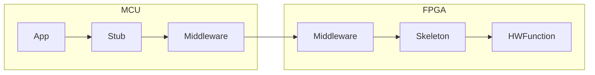

# Using the neural network accelerator

To expose the network accelerator to an application, running on
an MCU, we use a middleware.
An application can call a small set of c functions (stub),
to interact with a given HWFunction.
This stub is specific to its corresponding HWFunction.
In our case the HWFunction corresponds to the neural network accelerator.

 - **App**: user supplied application, calling stub to access neural network accelerator (HWFunction)
 - **Stub**:
   - passes data to the HWFunction and starts the computation
   - returns results of computation
   - allows **App** to check if HWFunction is loaded or not
   - allows **App** to load HWFunction
 - **Middleware**:
   - load bitfiles from specific addresses in flash memory
   - disable/enable skeleton, ie. its corresponding HWFunction
   - pass memory mapped io through to skeleton
 - **Skeleton**:
   - counterpart to stub
   - specific to HWFunction
 - **HWFunction**:
   - in general an arbitrary function we want to execute on the FPGA
   - here: the neural network accelerator

## Middleware Memory Mapped IO

**Control Region: 0x00 - 0xFF:**
- LED: 0x03 (1 byte)
  - each of the lowest four bits control one of the LEDs
  - 0=off, 1=on
- USERLOGIC_CONTROL: 0x04 (1 byte)
  - lowest bit enables (1) / disables (0) the skeleton
- Multiboot: 0x05 - 0x07 (3 bytes)
  - start address of the configuration to load from flash
  - triggers reconfiguration after write to 0x07 is complete
  - always write all three bytes
  - starting with the lowest byte of the address to 0x05
- other addresses are reserved for future uses

**User Logic Region: 0x100 - ??**
- passed through to skeleton
- the offset 0x100 is transparent to stub and skeleton

## Skeleton
The supported address range for the neural network skeleton ranges from
0 to 20000.
The skeleton we use for neural networks uses its memory mapped io
as follows:

|mode | address (bytewise) | value (byte) | meaning                  |
+-----+--------------------+--------------+--------------------------+
|write| 100                | 0x01         | start computation        |
|write| 0 to 99            | arbitrary    | write up to 99 bytes of input data |
|read |   1                | ??           | read 1 byte of computation result |
